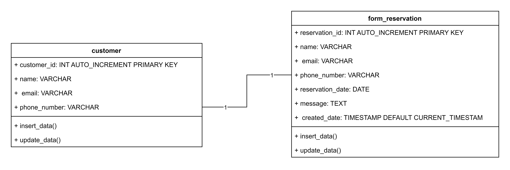
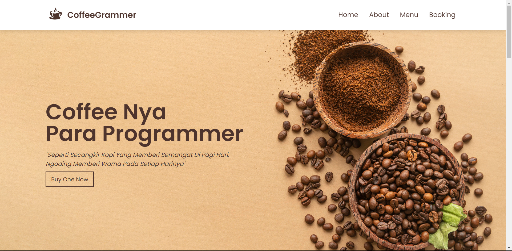
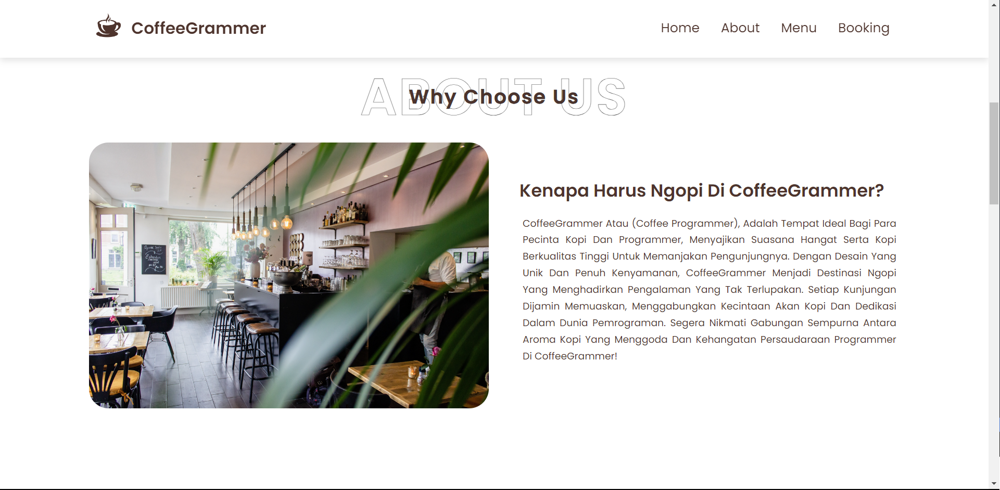
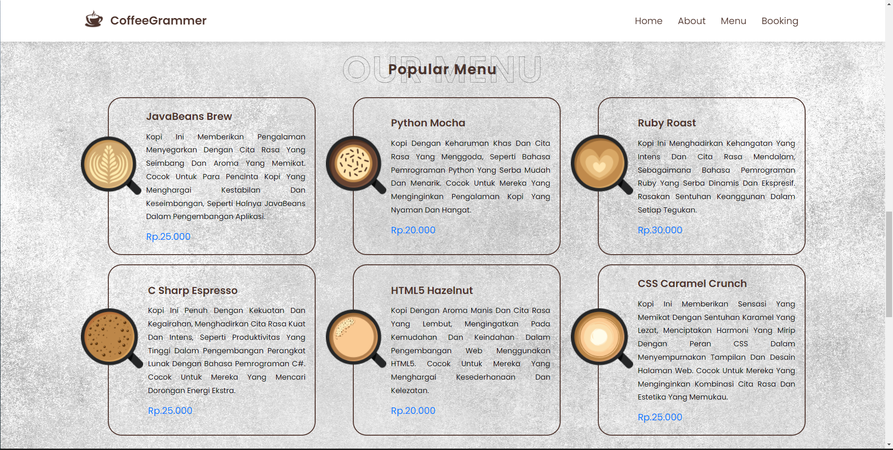
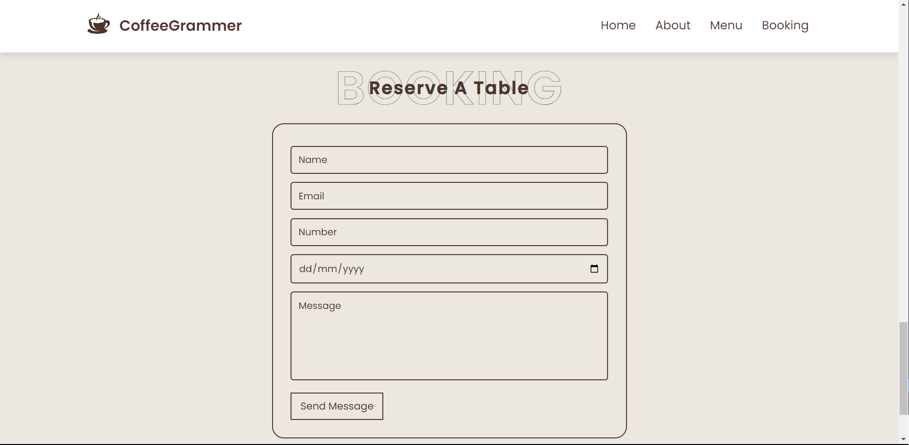
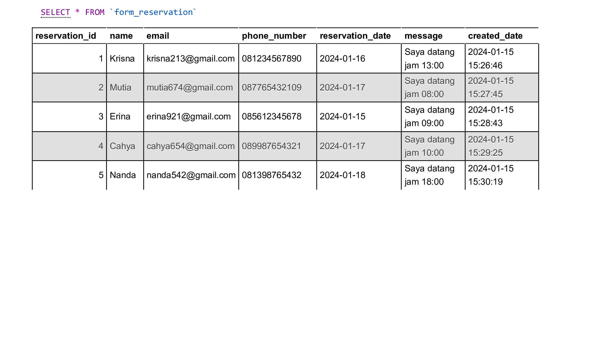

# Dokumentasi Website "CoffeeGrammer"

## Ide dan Tujuan Proyek
CoffeeGrammer adalah sebuah konsep website kafe fiksi yang menggabungkan dua komunitas yang berbeda, yaitu para pencinta kopi dan para programmer. 
Ide cemerlang ini muncul dari kesadaran akan kecenderungan banyak programmer yang menikmati secangkir kopi sebagai sahabat setia saat mereka sibuk bekerja atau ngoding. 
CoffeeGrammer berkomitmen untuk memberikan pengalaman tak terlupakan kepada setiap pengunjungnya dengan menghadirkan suasana hangat ala kafe yang penuh dengan semangat dan kopi berkualitas tinggi.

 

## Pengalaman Pengguna yang Diharapkan
- Navigasi Mudah: Pengguna diharapkan dapat dengan mudah menjelajahi halaman website menggunakan menu navigasi yang terletak di bagian atas.
- Informasi yang Jelas: Setiap bagian halaman menyajikan informasi dengan jelas, termasuk menu kopi, informasi tentang kafe, dan formulir untuk reservasi tempat.
- Desain yang Menarik: Desain website dirancang agar menarik perhatian pengunjung terutama mereka yang menyukai kopi dan dunia pemrograman.
- Reservasi tempat yang Mudah: Formulir reservasi dirancang sederhana untuk memudahkan pengunjung dalam melakukan reservasi.

 

## System Design
### 1. ERD dan Struktur Tabel
   
 
### 2. Class-Diagram
   

 

## Struktur Halaman
### 1. Page Home
   
 
### 2. Page About
   
 
### 3. Page Menu
   
 
### 4. Page Booking
   

 

### Data Dummy Database
   

Terima kasih telah mengunjungi CoffeeGrammer! ☕💻
