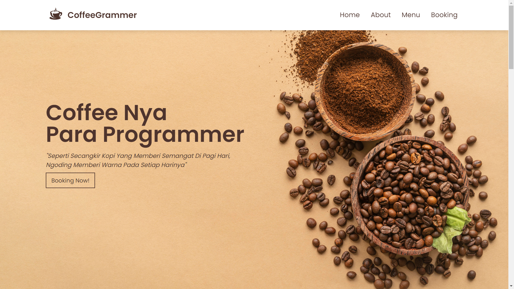

# Dokumentasi Website "CoffeeGrammer"

## Ide dan Tujuan Proyek
CoffeeGrammer adalah sebuah konsep website kafe fiksi yang menggabungkan dua komunitas yang berbeda, yaitu para pencinta kopi dan para programmer. 
Ide cemerlang ini muncul dari kesadaran akan kecenderungan banyak programmer yang menikmati secangkir kopi sebagai sahabat setia saat mereka sibuk bekerja atau ngoding. 
CoffeeGrammer berkomitmen untuk memberikan pengalaman tak terlupakan kepada setiap pengunjungnya dengan menghadirkan suasana hangat ala kafe yang penuh dengan semangat dan kopi berkualitas tinggi.

 

## Pengalaman Pengguna yang Diharapkan
- Navigasi Mudah: Pengguna diharapkan dapat dengan mudah menjelajahi halaman website menggunakan menu navigasi yang terletak di bagian atas.
- Informasi yang Jelas: Setiap bagian halaman menyajikan informasi dengan jelas, termasuk menu kopi, informasi tentang kafe, dan formulir untuk reservasi tempat.
- Desain yang Menarik: Desain website dirancang agar menarik perhatian pengunjung terutama mereka yang menyukai kopi dan dunia pemrograman.
- Reservasi tempat yang Mudah: Formulir reservasi dirancang sederhana untuk memudahkan pengunjung dalam melakukan reservasi.

 

## Tech Stack Website CoffeeGrammer
### Front-End:
-  : Digunakan untuk membuat struktur dasar halaman web.
-  : Bertanggung jawab untuk mengatur tata letak, warna, dan gaya halaman web.
-  : Memberikan interaktivitas pada halaman web dan berfungsi sebagai bahasa pemrograman klien.
### Back-End:
-  : Digunakan sebagai bahasa pemrograman server untuk memproses logika dan mengakses database.
### Database:
-  : Sistem manajemen basis data yang digunakan untuk menyimpan dan mengelola data terkait dengan CoffeeGrammer.

 

## Instruksi Penggunaan Website CoffeeGrammer
- Pertama, user dapat masuk ke halaman web tanpa login dan register.
- Kedua, setelah masuk user dapat dengan mudah menjelajahi halaman web dari Page Home, About, Menu, Dan Booking.
- Ketiga, di Page Booking jika user tertarik untuk mengunjungi CoffeeGrammer user dapat melakukan reservasi dengan mengisi form reservasi di Page Booking.

 

## System Design
### 1. ERD dan Struktur Tabel
   
 
### 2. Class-Diagram
   

 

## Struktur Halaman
### 1. Page Home
   
 
### 2. Page About
   
 
### 3. Page Menu
   
 
### 4. Page Booking
   

 

### Admin Panel Website CofeeGrammer
   

Terima kasih telah mengunjungi CoffeeGrammer! ☕💻
